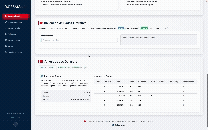

# Análise e Dashboard Interativo para Previsão de Vendas da Rossmann

<p align="center">
  
  
  
  
</p>

Este repositório documenta um projeto de ciência de dados de ponta a ponta, focado na **previsão de vendas diárias** para a rede de drogarias europeia **Rossmann**. A solução abrange desde a **limpeza e análise exploratória de dados** até a construção de um **modelo preditivo com Prophet** e entrega de um **dashboard interativo em Dash/Plotly** como ferramenta de Business Intelligence.

---

## 1. O Desafio de Negócio

A capacidade de prever a demanda com precisão é um pilar estratégico para o sucesso no varejo. Para a Rossmann, otimizar as operações em milhares de lojas é fundamental para a lucratividade.

Uma previsão de vendas precisa impacta diretamente:

- **Gestão de Estoque**: Evitar rupturas e excesso de estoque.
- **Planejamento de Pessoal**: Alocar corretamente os funcionários.
- **Estratégias de Marketing**: Medir impacto real de campanhas e feriados.

---

## 2. O Processo de Ciência de Dados: Passo a Passo

### 2.1. Fonte de Dados

- `train.csv`: Histórico de vendas diárias por loja.
- `store.csv`: Metadados das lojas (tipo, promoções, concorrência, etc).

### 2.2. Limpeza e Tratamento de Dados

- Remoção de **172.817 registros** de lojas fechadas (`Open == 0`).
- Tratamento de **NaNs**:
  - `CompetitionDistance`: Média da coluna.
  - Datas de promoções e concorrência: Preenchidos com `0` como indicador de "não aplicável".

### 2.3. Análise Exploratória de Dados (EDA)

A fase de EDA foi fundamental para compreender a estrutura dos dados e extrair insights que guiaram a modelagem. As principais descobertas foram:

-   **Correlação entre Vendas e Clientes**: A análise da matriz de correlação mostrou uma **correlação positiva muito forte de 0.82** entre as variáveis `Sales` e `Customers`. Isso confirma a hipótese intuitiva de que o número de clientes que visitam uma loja é o principal impulsionador do volume de vendas. Essa relação é a mais importante do ponto de vista de negócio.

-   **Impacto Quantitativo das Promoções (`Promo`)**: A análise foi além da simples correlação. Ao agrupar as vendas por dias com e sem promoção, foi possível quantificar o impacto:
    -   **Média de Vendas sem Promoção**: € 5.929,41
    -   **Média de Vendas com Promoção**: € 8.228,28
    -   **Conclusão**: As promoções diárias geram um **aumento médio de 38.77%** nas vendas. A análise visual com boxplots e gráficos de densidade mostrou que toda a distribuição de vendas é deslocada para valores mais altos em dias promocionais.

-   **Padrões de Sazonalidade**: A análise de séries temporais revelou múltiplos padrões sazonais:
    -   **Sazonalidade Anual**: Um pico de vendas massivo e consistente em **Dezembro**, impulsionado pelas compras de Natal, seguido por uma queda acentuada em Janeiro e Fevereiro.
    -   **Sazonalidade Semanal**: As vendas médias são mais altas no início da semana, especialmente na **Segunda-feira (Dia 1)**, e diminuem progressivamente, atingindo o ponto mais baixo no Domingo (Dia 7), mesmo considerando apenas as lojas que abrem neste dia.
    -   **Padrão Mensal**: Observou-se uma tendência de vendas mais altas nos primeiros dias de cada mês, o que provavelmente está correlacionado com os ciclos de pagamento de salários dos consumidores.

-   **Desempenho por Segmento de Loja (`StoreType`)**: A análise agrupada por tipo de loja revelou uma segmentação clara de desempenho:
    -   O **`StoreType 'b'`** demonstrou ter uma média de vendas consistentemente e significativamente superior a todos os outros tipos.
    -   Os `StoreType`s 'a', 'c' e 'd' apresentaram um desempenho de vendas muito similar entre si, operando em um patamar consideravelmente inferior ao do tipo 'b'.

-   **Influência da Competição**: A variável `CompetitionDistance` mostrou uma correlação negativa fraca com `Sales` (-0.04) e `Customers` (-0.15). Isso sugere que, embora não seja um fator linear forte, lojas com competidores mais próximos tendem a ter um número ligeiramente maior de clientes, talvez por estarem localizadas em áreas de maior tráfego comercial.

### 2.4. Engenharia de Features

A criação de novas features é um passo fundamental para extrair mais informações dos dados brutos e melhorar a performance do modelo preditivo. As seguintes features foram criadas:

-   **Features Temporais Básicas**:
    -   **O que são?**: `Year`, `Month`, `Day` foram extraídos da coluna `Date`.
    -   **Por que foram criadas?**: Decompor a data permite que o modelo identifique padrões e tendências associados a cada um desses componentes de forma independente. Por exemplo, o modelo pode aprender que certos meses (como Dezembro) ou dias do mês (como o início) têm um impacto específico nas vendas.

---

## 3. Modelagem Preditiva com Prophet

### 3.1. Por que Prophet?

- Captura **sazonalidades múltiplas**.
- Suporte a **feriados, eventos e promoções**.
- **Robustez** a outliers e dados ausentes.
- Fácil **interpretação** dos componentes da previsão.

### 3.2. Implementação

1. Formatação do dataframe (`ds`, `y`).
2. Inclusão de regressores (`Promo`, feriados, etc).
3. Treinamento (`fit`) com histórico.
4. Geração de datas futuras.
5. Previsão e visualização com `predict`.

---

## 4. O Dashboard Interativo: Uma Ferramenta de Business Intelligence

O produto final do projeto é um dashboard web completo, que vai além de uma simples visualização de dados. Ele foi concebido como uma ferramenta de **Business Intelligence (BI)** e **suporte à decisão**, permitindo que usuários, desde gerentes de loja a analistas de negócio, explorem os dados históricos e consumam as previsões do modelo de forma intuitiva.

> 

### 4.1. Arquitetura e Tecnologias

| Camada             | Tecnologia/Ferramenta        | Propósito                                                  |
|--------------------|------------------------------|------------------------------------------------------------|
| Framework Web      | Dash (by Plotly)             | Construção da aplicação analítica inteiramente em Python.   |
| Visualização       | Plotly                       | Gráficos interativos de alta qualidade (zoom, pan, tooltips). |
| Layout e Estilo    | Dash Bootstrap + CSS         | Design responsivo.                                        |
| Performance        | Flask-Caching                | Armazena dados processados em cache para carregamentos rápidos. |

### 4.2. Guia de Funcionalidades por Seção (Aba)

O dashboard é organizado em uma navegação lateral que dá acesso a diferentes módulos de análise e previsão:

-   **`/` (Contextualização)**
    -   **Propósito**: Servir como página inicial, introduzindo o usuário ao projeto.
    -   **Conteúdo**: Apresenta o problema de negócio da Rossmann, os objetivos da análise e a importância da previsão de vendas para a estratégia da empresa.

-   **`/limpeza-dados` (Transparência do Processo)**
    -   **Propósito**: Garantir a transparência e a reprodutibilidade da análise.
    -   **Conteúdo**: Detalha as etapas de limpeza e tratamento dos dados, explicando as decisões tomadas, como a remoção de dias de loja fechada e a imputação de valores ausentes. Isso constrói confiança nos dados apresentados.

-   **`/analise-preliminar` (Análise Exploratória)**
    -   **Propósito**: Exibir os insights mais importantes da fase de EDA.
    -   **Conteúdo**: Apresenta visualizações interativas dos principais padrões descobertos, como a forte sazonalidade anual e semanal, o impacto quantificado das promoções e a matriz de correlação das variáveis.

-   **`/dashboard` (Dashboard Geral)**
    -   **Propósito**: Fornecer uma visão macro dos indicadores de desempenho.
    -   **Conteúdo**: Um painel com KPIs (Key Performance Indicators) essenciais, como a média geral de vendas, o número total de clientes e gráficos que resumem as tendências de vendas ao longo do tempo.

-   **`/analise-lojas` (Análise por Segmento)**
    -   **Propósito**: Permitir a comparação de desempenho entre diferentes tipos de loja.
    -   **Conteúdo**: Gráficos comparativos que segmentam as vendas e outras métricas pelos `StoreType`s ('a', 'b', 'c', 'd'), evidenciando o desempenho superior do tipo 'b'.

-   **`/analise-3d` (Análise Multivariada)**
    -   **Propósito**: Explorar a relação complexa entre três variáveis de forma simultânea.
    -   **Conteúdo**: Um gráfico 3D interativo onde o usuário pode rotacionar o eixo para visualizar a relação entre Vendas, Clientes e Promoções, oferecendo uma perspectiva única e mais profunda dos dados.

-   **`/previsao-vendas` (Ferramenta de Previsão)**
    -   **Propósito**: Ser a ferramenta de suporte à decisão mais importante, fornecendo previsões de vendas acionáveis para o planejamento operacional.
    -   **Fluxo de Uso**: 
        1.  O usuário seleciona um **ID de Loja** específico em um menu dropdown.
        2.  Define um **período de previsão** (em dias) para o qual deseja a estimativa.
        3.  Ao clicar em **"Gerar Previsão"**, uma chamada é feita ao backend, que executa o modelo Prophet treinado para aquela loja.
        4.  O resultado é exibido em um gráfico Plotly interativo que mostra:
            -   **Vendas Históricas** (linha azul contínua).
            -   **Previsão Futura (`yhat`)** (linha azul pontilhada).
            -   **Intervalo de Confiança** (área sombreada), que representa a incerteza da previsão. Isso é crucial para o planejamento, pois permite visualizar os cenários mais otimistas e pessimistas.

---

## 5. Estrutura de Arquivos do Projeto

A organização do projeto foi pensada para garantir modularidade, escalabilidade e facilidade de manutenção.

```
/
├── dashboard/                # Contém toda a aplicação web Dash.
│   ├── app.py                # Ponto de entrada da aplicação, define o servidor e o layout principal.
│   ├── assets/               # Arquivos estáticos (CSS, imagens, etc.).
│   │   ├── css/
│   │   └── images/
│   ├── callbacks/            # Lógica reativa do dashboard (o que acontece quando um botão é clicado).
│   ├── core/                 # Lógica de negócio principal (utils, configs, lógica de previsão).
│   ├── data/                 # Módulos para carregamento e manipulação de dados.
│   └── layouts/              # Módulos que definem a estrutura visual de cada página/aba.
├── dataset/                  # Conjuntos de dados utilizados no projeto.
│   ├── brutos/               # Dados originais, sem tratamento.
│   └── processados/          # Dados limpos e transformados, prontos para análise.
├── notebooks/                # Jupyter Notebooks para exploração, modelagem e testes.
├── .gitignore                # Arquivos e pastas a serem ignorados pelo Git.
├── requirements.txt          # Dependências Python do projeto.
├── setup.py                  # Script de configuração para distribuição do projeto.
└── README.md                 # Documentação do projeto.
```
